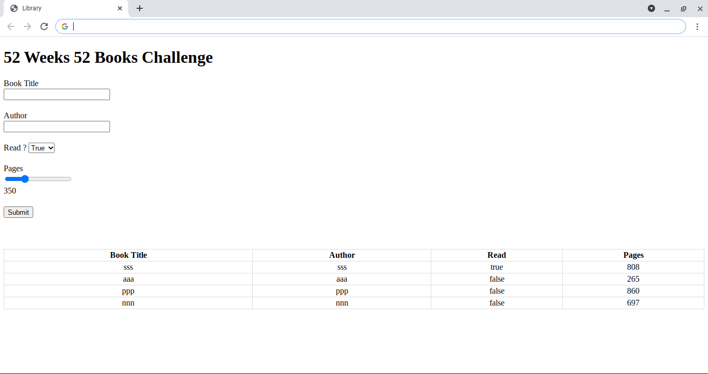

# odin-project-library
Odin Project JavaScript - Library exercise

- [Odin Project](https://theodinproject.com/courses/javascript/lessons/library)

- [Stack Overflow](https://stackoverflow.com/questions/16427636/check-if-localstorage-is-available) - Local Storage Available?

- [Blog](https://www.taniarascia.com/how-to-use-local-storage-with-javascript/) - Local Storage 

